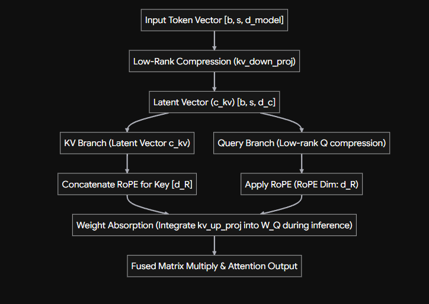
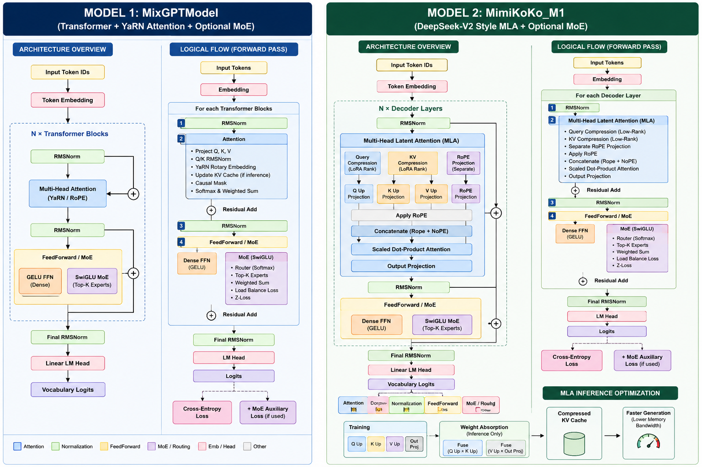

# Pretraining models with Mixture of Experts  

Model collection for building your own LLM End-to-End.  


## 🚀 Features  
* **Mistral-style Sparse MoE** Core: Custom deterministic token routing logic mapping tokens to top- $k$ expert sub-networks to increase model capacity without proportional compute costs.
* **Dropless Routing** for MoE: It processes every single token. If an expert is assigned 10x more tokens than others, the model calculates all of them. This ensures no information loss and makes it run faster in GPU based training.  
* **RoPE** and **YaRN** scaling to improve long-context coherence and scaling.  
* **QK Norm**: Modern layer normalization applied globally for stabilizer scale-invariance during high-throughput training runs.  
* Hyperparameter Scaling Configuration: Integrated tuning layout designed to quickly experiment with model sizes, expert counts, and optimization boundaries.  
* MLA with weight absorption (DeepSeek-V2).  
* Deep-Network Residual Scaling Initialization, to avoid model drifting during scaling.  
* *min-p* and *temp* scaling for autoregressive decoding.  
* Can be trained and used in both **Windows** and **Linux** based environments, bypassing certain FlashAttention and Linux ONLY requirement bottlenecks.  


*To-Do*: Add **Per-Layer QK-Norm** like Minimax M2.  


## Models  

### MixGPT  

This MHA-MoE fusion variant implements a Decoder Transformer with a sparse top- $k$ gating routing layer over multiple Feed-Forward Network (FFN) blocks, which uses *SwiGLU* activation.  

It has Dense FeedForward Network too, which can use either *SwiGLU* or *GELU* activations.  

__🏗️ Architecture Design__  

```
[Token Input] -> [Embedding + RoPE] -> [Multi-Head Attention] -> [MoE Gate Router]
                                                                        |
                                                 --------------------------------
                                                |               |                |
                                            [Expert 1]      [Expert 2]   ... [Expert N]
                                                |               |                |
                                                 --------------------------------
                                                                |
                                                           [RMSNorm] -> [Token Prediction Output]
```  


The model integrates RoPE and YaRN scaling. So if `scale_factor` is 1, it uses RoPE, otherwise YaRN scaling.  
During inference, you can adjust `new_scale_factor` to get higher context length range.  

```python
    new_scale_factor:int = 0  # Adjust this if you want to extend context further during generation
    final_scale_factor = og_scale_factor + new_scale_factor
``` 

### MimiKoKo-M1  

DeepSeek-V2 MLA architecture for Single GPU usage. It can use either Dense or MoE as FFN. This architecture can use a mixture of MoE and non-MoE FFN, just like the original DS-V2.  


__🏗️ Architecture Design__  
 

__Attention Topology__  

  


__Model Topology__  

```text
[Input Tokens]
       │
   [Embedding]
       │
 ┌─────┴──────────────────────────────────┐
 │  Transformer Decoder Layer (x Layers)  │
 │                                        │
 │  ┌───────────[ RMSNorm ]────────────┐  │
 │  │                                  │  │
 │  │   Multi-Head Latent Attention   │  │
 │  │   - Low-Rank Compression        │  │
 │  │   - Weight Absorption Matrix    │  │
 │  └──────────────────────────────────┘  │
 │                  │                     │
 │            (Residual Add)              │
 │                  │                     │
 │  ┌───────────[ RMSNorm ]────────────┐  │
 │  │                                  │  │
 │  │     MoE Block / SwiGLU FFN       │  │
 │  │     - Top-K Expert Router        │  │
 │  │     - Token Indexing (No Pad)    │  │
 │  └──────────────────────────────────┘  │
 │                  │                     │
 │            (Residual Add)              │
 └──────────────────┬─────────────────────┘
                    │
              [ Final Norm ]
                    │
               [ LM Head ] ──> [ Output Logits ]
```  


  


## 🧠 Inference  

Integrated `min_p` and `temp` filtering to select the best token.  

```python 
    prompt = "The cat is a"
    gen_token_count = 512

    print(f"\nGenerating with Min-P...")
    gen_st_time = time.perf_counter()

    token_ids = generate(
        model=model,
        tokenizer=tokenizer,
        prompt=prompt.strip(),
        device=device,
        max_new_tokens=gen_token_count,
        temp=0.5,
        min_p=0.1,
        use_cache=True
    )
```  

There are few optimizations that have been left out, which are normally geared towards Linux environment.  
(Compile, Grouped GEMMs, FlashAttention kernel, ...)

________________  

## 📈 Training Run Stats  

__*Resource usage comparison*__ =>  

1) **MixGPT**  

    Comparing Multi-Head Attention, for __Dense__ and __MoE__ config >>>  

    ```
    org_context_length = 1024  
    scale_factor = 2  
    d_model = 1024  
    num_heads = 16  
    num_layers = 8  
    hidden_dim_multiplier = 6

    num_experts= 2 
    top_k_experts = 1 
    hidden_dim_multplier_perexp = 2

    tot_steps = 2500  
    batch_size = 2  
    grad_accum_steps = 1  
    ```  

    ***MoE*** (Total param: 138.78M | Active: 88.45M)  
    * Training runtime: 1458.85 s  
    * GPU VRAM: 5.8 GB  
    * Avg. Step time: 0.5725 s  

    ***Dense*** (Total param: 138.77M)  
    * Training runtime: 1802.65 s  
    * GPU VRAM: 8.2 GB  
    * Avg. Step time: 0.6502 s  

    With `bf16` precision one can reach this max scale on a free Colab GPU:  

    ```
    org_context_length: 2048  
    scale: 2  
    model_dim: 1536  
    num_heads: 16  
    num_layers: 12  

    (14.4 GB GPU)  
    Total parameters: 459.86M
    ```  

2) **MimiKoKo-M1**  
    For MLA, one can use these approx. max configs on a free Colab GPU:  

    ```
    (MoE) 
    d_model: int = 1536
    num_heads: int = 16
    num_layers: int = 12
    org_context_length: int = 1024 
    ... 
    MoEArgs(num_experts=3, top_k_experts=1, hidden_dim_multplier_perexp=2, first_moe_layer=2) 

    (Dense) 
    d_model: int = 2048
    num_heads: int = 16
    num_layers: int = 12
    org_context_length: int = 1024 
    hidden_dim_multiplier: int = 4 
    ```  

    Max param count:  
    ***MoE >>>  
    Total parameters: 610.48M  
    Active: 327.36M | Shared: 185.80224M  
    GPU: 13.9 GB***  

    ***FF >>>  
    Total parameters: 566.44M  
    GPU: 13.4 GB***  


Fastest inference time was for Dense variant with kv-cache ON.  


________  


